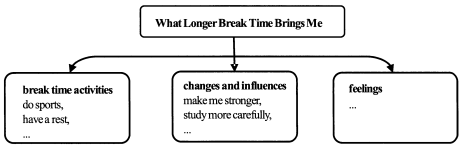
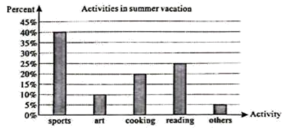
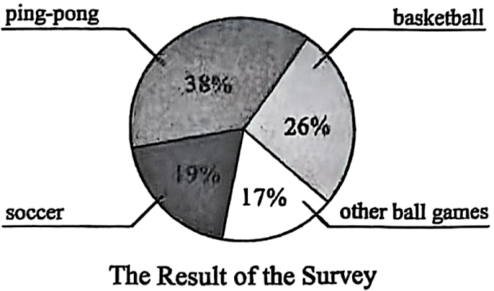
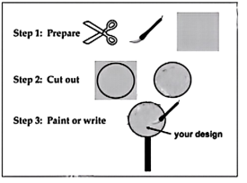
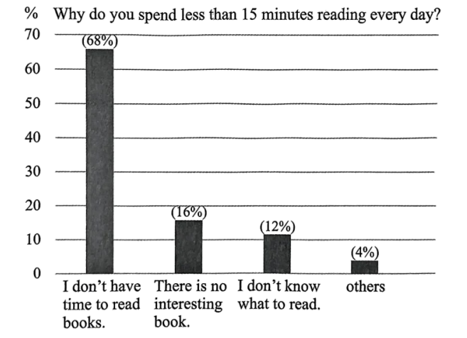
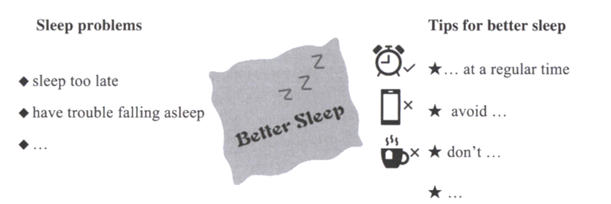
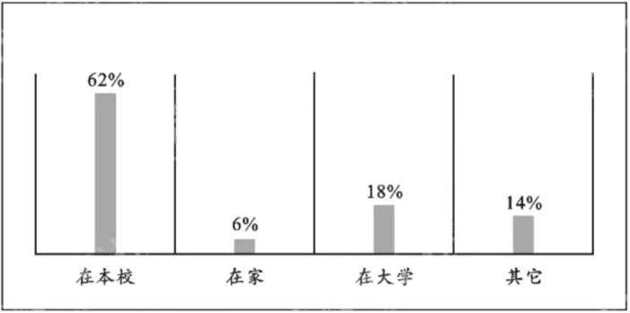
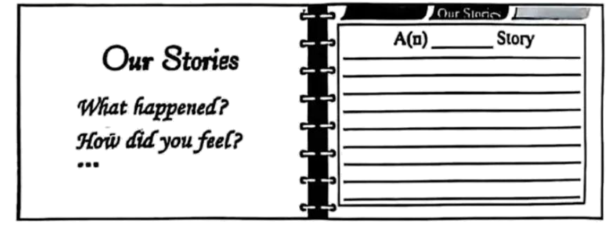
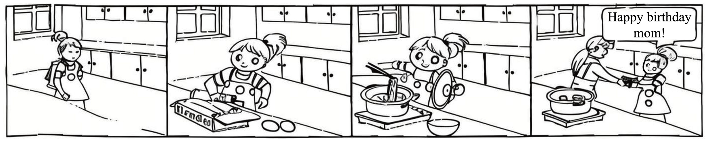

# 2025年中考英语作文真题及黄金解析合集 (已校准)
> 本合集已自动校准 `原卷.md` 中的高精题干与 `解析.md` 中的范文、详解、词块句型储备。图片已统一归档至 `images/` 下。

---

## 观点看法类 (Topic 42)
本专题下共收录 2025 年中考真题 **9** 道。

### 1. （2025·山东临沂·中考真题）
#### 📝 完整写作要求及提示 (已校准)
某英文网站正在开展以 “体质健康提升” 为主题的征文活动。请你以“How I Improve My Physical Health”为题，用英语写一篇短文投稿，谈谈你在体质健康提升方面的做法和理由。

提示:1. What kind of exercise do you usually do?

2. How do you do exercise?

3. What else can help you to improve your physical health? Give your reasons.

要求：1.词数不少于80，开头已经写好，不计入总词数；

2.语言通顺，条理清楚，书写规范；

3.文中不要出现任何真实人名、校名及其他相关信息，否则不予评分。

How I Improve My Physical Health

Nowadays, people pay much more attention to physical health. For me,

#### 🌟 官方参考范文
【答案】例文：

How I Improve My Physical Health

Nowadays, people pay much more attention to physical health. For me, I take several steps to keep fit and improve my physical health.

First, I usually do different kinds of exercise. I enjoy jogging in the morning because it helps me stay energetic throughout the day. Sometimes, I play basketball with my friends, which improves my teamwork and coordination. Second, I exercise regularly. I set a schedule and stick to it, such as running three times a week and playing basketball on weekends. By doing this, I build a good habit and avoid laziness. Besides exercise, I also pay attention to my diet. I eat more vegetables and fruits instead of junk food, which provides enough nutrients for my body. Moreover, I make sure to get enough sleep every night because rest is as important as exercise for staying healthy.

In conclusion, by exercising regularly, eating healthily, and resting well, I can improve my physical health effectively.

#### 💡 详细考点剖析及词句储备
【详解】[总体分析]

①题材：本文是一篇材料作文；

②时态：一般现在时；

③提示：内容要点已给出，考生需围绕运动、饮食和睡眠展开，适当添加细节，确保逻辑清晰。

[写作步骤]

第一步，开门见山，引出话题，表明自己重视体质健康；

第二步，分点介绍锻炼方式、规律运动以及饮食习惯；

第三步，总结全文，强调健康生活方式的重要性。

[亮点词汇]

①pay much more attention to 更加关注

②different kinds of 不同种类的

③stick to坚持

④build a good habit 养成好习惯

⑤instead of 而不是

[高分句型]

①Sometimes, I play basketball with my friends, which improves my teamwork and coordination.（which引导的非限制性状语从句）

②Moreover, I make sure to get enough sleep every night because rest is as important as exercise for staying healthy. （because引导的原因状语从句）

---

### 2. （2025·河南·中考真题）
#### 📝 完整写作要求及提示 (已校准)
假设你是李华，准备在学校毕业典礼（graduation ceremony）活动中演唱英文歌曲，想找一位搭档（partner）与你合唱Auld Lang Syne（《友谊地久天长》）。请你以 “The partner I’m looking for” 为主题，根据写作提示，用英语写一篇发言稿，表达你对搭档的期许并陈述理由，在英语课前Daily speech环节进行分享。

写作提示：l. Would you like a boy or a girl to be your partner?

2. What do you hope he/she is good at? And why?

3. What kind of person do you hope he/she is? And why?

写作要求：1. 文中须包含以上写作提示中的所有信息，可适当发挥：

2. 文中不得出现真实姓名和学校名称；

3. 词数100左右（文中已给出内容不计入总词数）。

Hello, everyone! I’m looking for a partner to sing the English song Auld Lang Syne with me at the graduation ceremony.

Thanks for listening!

#### 🌟 官方参考范文
【答案】例文：

Hello, everyone! I’m looking for a partner to sing the English song Auld Lang Syne with me at the graduation ceremony.

I don’t mind whether my partner is a boy or a girl. What matters most is that he/she is good at singing and speaks English fluently. Because the song is in English, clear pronunciation will help us move the audience. I also hope he/she is friendly and confident. A friendly person will make practicing together enjoyable, and confidence will help us perform better on stage. Lastly, I hope he/she is hardworking and punctual, so we can rehearse on time and perfect our performance. If you’re interested, please talk to me after class!

Thanks for listening!

#### 💡 详细考点剖析及词句储备
【详解】[总体分析]

①题材：本文是一篇发言稿；

②时态：时态为“一般现在时”；

③提示：写作要点已给出，要求根据提示内容进行写作，适当添加细节，并突出写作重点。

[写作步骤]

第一步，表明写作意图；

第二步，具体介绍希望搭档是男孩还是女孩，擅长什么以及原因，性格如何以及原因；

第三步，书写结语。

[亮点词汇]

①be good at 擅长

②on stage 在舞台上

③on time 准时

[高分句型]

①Lastly, I hope he/she is hardworking and punctual, so we can rehearse on time and perfect our performance.（宾语从句和并列句）

②If you’re interested, please talk to me after class!（条件状语从句）

---

### 3. （2025·黑龙江·中考真题）
#### 📝 完整写作要求及提示 (已校准)
我国的飞速发展吸引了大量外国游客来中国旅游。他们不仅赞叹中国智能、便捷的生活方式，更爱上了中国的传统文化，掀起了学习汉语的热潮。请你结合自身的学习经验，从语言学习的听、说、读、看、写等方面为外国朋友推荐五条学好汉语的方法。

要求：1.字迹工整，表达清楚，语法正确；

2. 词数：30—50词。

#### 🌟 官方参考范文
【答案】范文：

What Longer Break Time Brings Me

This term, we have five more minutes for break time. During the longer break time, I can do more sports and have a better rest. Basketball is my favourite. I have more time to practice it with my friends. It’s a good time for me to take in some fresh air and enjoy the sunshine.

Sports make me stronger and healthier. Besides, enough rest makes me more relaxed so I can study more carefully than before. I even have time to share something interesting with my classmates. I’m more outgoing and happier now.

I like the longer break time because it not only makes my school life colorful but also helps me keep healthy.

#### 💡 详细考点剖析及词句储备
【详解】[总体分析]

①题材：本文是一篇材料作文；

②时态：时态为一般现在时；

③提示：根据提示内容完成写作，适当增加细节，突出写作重点。

[写作步骤]

第一步，介绍休息时间的活动；

第二步，介绍更长的休息时间带来的变化和影响；

第三步，介绍自己的感受。

[亮点词汇]

①take in吸入

②share sth. with sb.和某人分享某物

[高分句型]

①Besides, enough rest makes me more relaxed so I can study more carefully than before. (so连接的并列句)

②I like the longer break time because it not only makes my school life colorful but also helps me keep healthy. (because引导的原因状语从句)

---

### 4. （2025·黑龙江·中考真题）
#### 📝 完整写作要求及提示 (已校准)
今年春季开学，多地中小学将课间时长由10分钟延长至15分钟，切实的把时间和空间还给了学生。请根据这学期你的真实感受，以“What Longer Break Time Brings Me”为题，结合下面思维导图，谈谈你对这一改变的看法。

[图片：原卷-13]

要求：1.字迹工整，段落清晰，表达清楚，语法正确，行文连贯；

2.要点必须包含所有相关信息，并适当发挥；

3.首句已给出，不计入总词数；

4. 词数：80—100词。

What Longer Break Time Brings Me

This term, we have five more minutes for break time. During the longer break time, I can

#### 🌟 官方参考范文
【答案】范文：

What Longer Break Time Brings Me

This term, we have five more minutes for break time. During the longer break time, I can do more sports and have a better rest. Basketball is my favourite. I have more time to practice it with my friends. It’s a good time for me to take in some fresh air and enjoy the sunshine.

Sports make me stronger and healthier. Besides, enough rest makes me more relaxed so I can study more carefully than before. I even have time to share something interesting with my classmates. I’m more outgoing and happier now.

I like the longer break time because it not only makes my school life colorful but also helps me keep healthy.

#### 💡 详细考点剖析及词句储备
【详解】[总体分析]

①题材：本文是一篇材料作文；

②时态：时态为一般现在时；

③提示：根据提示内容完成写作，适当增加细节，突出写作重点。

[写作步骤]

第一步，介绍休息时间的活动；

第二步，介绍更长的休息时间带来的变化和影响；

第三步，介绍自己的感受。

[亮点词汇]

①take in吸入

②share sth. with sb.和某人分享某物

[高分句型]

①Besides, enough rest makes me more relaxed so I can study more carefully than before. (so连接的并列句)

②I like the longer break time because it not only makes my school life colorful but also helps me keep healthy. (because引导的原因状语从句)

---

### 5. （2025·湖北·中考真题）
#### 📝 完整写作要求及提示 (已校准)
假如你是王华，你校英语报Happy Times 正在征集关于本学期社会实践（field trip）方案的意见。请写一封邮件将你的意见发送到指定邮箱。邮件内容包括：

1. 从下面两个方案中挑选一个并说明理由；

2. 为该方案增补两项你喜欢的活动。

注意:

1. 根据上图所给提示，适当发挥；

2. 文中不得出现真实姓名和校名；

3. 词数80左右，开头和结尾已给出，不计入总词数。

#### 🌟 官方参考范文
【答案】例文：

Dear Sir/Madam,

I’d like to recommend Plan B (Visiting the Science Park) for our field trip. The reason is that many students, including me, are interested in science and technology. It’s a great chance to explore programming and experiments, which are both educational and fun.

For additional activities, I suggest: Trying a virtual reality (VR) experience to learn about future technologies. Attending a workshop to build simple robots.

These activities will make the trip more wonderful. Looking forward to your reply!

Best wishes!

Yours,

Wang Hua

#### 💡 详细考点剖析及词句储备
【详解】[总体分析]

①题材：本文是一篇建议信（电子邮件）；

②时态：时态是“一般现在时”；

③提示：需包含选择方案、说明理由和增补活动的三个要点。

[写作步骤]

①第一步：礼貌提出建议（选择Plan B）；

②第二步：说明选择理由（对科技感兴趣）；

③第三步：增补两项活动（VR体验和机器人制作）；

④第四步：总结并表达期待。

[亮点词汇]

①science and technology 科技

②programming 编程

③experiments 实验

④educational 有教育意义的

[高分句型]

It’s a great chance to explore programming and experiments, which are both educational and fun.（It固定句型，which引导定语从句）

---

### 6. （2025·湖南·中考真题）
#### 📝 完整写作要求及提示 (已校准)
在假期，我们应该更多地陪伴家人还是朋友呢？在学校英语论坛上，同学们以此为话题发帖讨论。假如你是李华，请你跟帖参与讨论。

内容包括：

（1）陈述你的观点并说明理由；

（2）结合观点，介绍你的假期计划。

注意：

（1）文中不得出现真实姓名和校名等信息；

（2）写作词数为80个左右。

#### 🌟 官方参考范文
【答案】例文

I think we should spend more time with family during holidays. Family members give us unconditional love and support, and holidays are the perfect time to strengthen these bonds.

During this vacation, I plan to help my parents with housework and cook meals together. We will also visit my grandparents, as they always enjoy sharing stories with me. Of course, I won’t forget my friends—I will make a video call to them every week and meet for a short outing. But family comes first because they are my lifelong pillars.

#### 💡 详细考点剖析及词句储备
【详解】[总体分析]

① 题材：本文是一篇材料作文；

② 时态：“一般现在时”和“一般将来时”；

③ 提示：根据题干要求完成观点陈述和假期计划说明，需包含两个指定要点，注意不要有语法错误。

[写作步骤]

第一步：明确表达观点；

第二步：给出支持观点的理由；

第三步：具体描述假期计划。

[亮点词汇]

① unconditional love 无条件的爱

② strengthen bonds 加强联系

③ lifelong pillars 终身支柱

[高分句型]

①We will also visit my grandparents, as they always enjoy sharing stories with me.（as引导原因状语从句）

②But family comes first because they are my lifelong pillars.（because引导原因状语从句）

---

### 7. （2025·江苏扬州·中考真题）
#### 📝 完整写作要求及提示 (已校准)
校园是一个充满“美”的地方。为了感受、记录、分享校园之“美” ，你校英语俱乐部将开展以“The beauty of our school”为主题的小组实践活动，请你根据以下提示和要求用英语完成一份小组活动计划。

提示： (1) What do you record? (choose one point: views/people/activities… )

(2) How do you record and share it? And why?

(3) What do you expect to get from this group activity? (list at least two points)

要求：

(1) 表达清楚，语法正确，上下文连贯；

(2) 必须包括提示中的所有信息，并按要求适当发挥；

(3) 词数：100词左右 (开头已给出，不计入总词数)；

(4)不得使用真实姓名、校名和地名等。

To present the beauty of our school, we plan to record

#### 🌟 官方参考范文
【答案】例文：

To present the beauty of our school, we plan to record the people. We will mainly focus on our teachers and classmates during their daily activities, like teaching, studying together, or helping each other. We plan to take photos and write short notes about these heartwarming moments. Photos capture real expressions and feelings instantly, making the beauty vivid. Then, we will share them on the school website or our club’s social media page. This way, more people inside and outside school can see the warm human spirit in our school.

From this activity, we expect to understand our school community better and learn to appreciate the kindness around us. We also hope to work better as a team.

#### 💡 详细考点剖析及词句储备
【详解】[总体分析]

① 题材：本文属于材料作文写作；

② 时态：时态为“一般将来时”和“一般现在时”；

③ 提示：写作要点已给出，考生需围绕“记录的内容、记录和分享的方式及原因、预期收获”展开叙述，注意使用第一人称，并适当添加细节。

[写作步骤]

第一步，开篇点题，明确记录的对象（people），并简要说明具体内容（teachers and classmates）；

第二步，具体阐述记录方式（photos and short notes）和分享渠道（school website/social media），并解释原因（capture real expressions, spread warmth）；

第三步，总结预期收获（understand community better, appreciate kindness, teamwork），呼应主题。

[亮点词汇]

①heartwarming moments暖心时刻

②capture real expressions捕捉真实表情

③human spirit人文精神

④appreciate the kindness感恩善意

[高分句型]

① Photos capture real expressions and feelings instantly, making the beauty vivid.（现在分词作状语）

---

### 8. 8．（2025·四川遂宁·中考真题）
#### 📝 完整写作要求及提示 (已校准)
假如你是李华，你收到一封来自外国朋友Alan的电子邮件，他与你分享了校园生活。请根据以下内容，给他回复一封邮件。

注意：

1. 不少于80词，文章开头已给出，不计入字数；

2. 表达你的观点，给出两点理由并进行阐述；

3. 要求语句通顺，行文连贯；

4. 文章中不得出现真实的人名、校名和地名。

Dear Alan,

I’m glad to get your e-mail and I really understand you.

Yours,

Li Hua

#### 🌟 官方参考范文
【答案】例文

Dear Alan,

I’m glad to get your e-mail and I really understand you. However, I think doing exercise is important for us. Here are my reasons.

First, exercise helps us strengthen our health. Though you feel tired now, regular exercise will make you stronger. For example, it can improve your sleep and give you more energy.

Second, exercise reduces stress. After studying for a long time, playing sports helps you relax and clear your mind. You might even find it fun once you get used to it!

Don’t worry if you’re not good at it now. Just try your best and do it step by step. You’ll see the difference soon!

Yours,

Li Hua

#### 💡 详细考点剖析及词句储备
【详解】[总体分析]

①题材：本文是一封电子邮件；

②时态：时态为“一般现在时”；

③提示：写作要点已给出，要求根据提示内容进行写作，适当添加细节，并突出写作重点。

[写作步骤]

第一步，表明写作意图；

第二步，具体介绍做运动的好处；

第三步，书写结语。

[亮点词汇]

①strengthen our health 增强我们的健康

②get used to 习惯于

③be good at 擅长

④step by step 逐步地

[高分句型]

①Though you feel tired now, regular exercise will make you stronger.（让步状语从句）

②Don’t worry if you’re not good at it now.（条件状语从句）

---

### 9. 9.（2025·四川达州·中考真题）
#### 📝 完整写作要求及提示 (已校准)
暑期将至，腾飞中学根据学校“五育并举”实施方案，对100名学生的暑期活动安排进行了调查，请根据下图和以下内容提示，以“What Will Tengfei High School Students Do in Their Summer Vacation?”为题，用英语写一篇调查报告

内容提示：

体育活动：球类运动……    艺术活动：学习乐器……

烹饪活动：制作菜肴……    阅读活动：读书看报……

其它活动：

[图片：原卷-18]

写作要求：

1.内容必须包括表格中所给要点，适当发挥一至两点，并阐明自己的观点。

2.语句通顺，语法正确，书写规范。

3.文中不能出现考生的真实姓名、校名、和地名。

4.不少于90词（开头已给出，不计入总词数）。

What will Tengfei High School Students Do in Their Summer Vacation?

Last week, we asked 100 students about their summer vacation activities. Our questions were about sports, art, cooking, reading and others. Here are the results.

#### 🌟 官方参考范文
【答案】例文：

What will Tengfei High School Students Do in Their Summer Vacation?

Last week, we asked 100 students about their summer vacation activities. Our questions were about sports, art, cooking, reading and others. Here are the results.

It is clear that sports are the most popular. 40% of students will do ball games like basketball and football. They think it is a great way to keep fit and have fun with friends. Only 10% of them take up art activities like learning a musical instrument. 20% of them prefer to cook. They want to make delicious dishes. 25% of them enjoy reading. Reading books or newspapers can open their minds. And the rest choose other activities such as traveling and volunteering in summer vacation.

In my opinion, these activities can make students’ summer vacations colorful and meaningful. They can not only develop skills but also relax themselves.

#### 💡 详细考点剖析及词句储备
【详解】[总体分析]

①题材：本文是一篇材料作文；

②时态：时态以“一般现在时”为主；

③提示：写作要点已给出，考生应注意不要遗漏内容提示，适当增加细节，并突出写作重点。

[写作步骤]

第一步，表明写作意图，开门见山，引出下文调查内容；

第二步，具体阐述调查结果内容；

第三步，阐述自己的观点，讲述暑期活动的意义。

[亮点词汇]

①such as比如

②prefer to do 更喜欢

③take up从事

④ not only...but also...不但……而且……

[高分句型]

①It is clear that sports are the most popular. （主语从句）

②They think it is a great way to keep fit and have fun with friends.（省略that的宾语从句）

---

## 说明介绍类 (Topic 43)
本专题下共收录 2025 年中考真题 **15** 道。

### 1. （2025·内蒙古·中考真题）
#### 📝 完整写作要求及提示 (已校准)
假定你是李明，你校准备组织一次英语演讲比赛，主题是“天蓝、地绿、水清的内蒙古”。你的外国朋友Oliver对这个主题很感兴趣，请你根据以下具体信息，写一封邮件，特邀他以观众的身份前来参加此次活动。

参考词汇：hold, give speeches, share stories, make progress, environment

注意：

1. 词数为80左右；

2. 可适当增加细节，以使行文连贯；

3. 文中不能出现真实姓名及学校名称；

4. 邮件的开头和结尾已给出，不计入总词数。

Dear Oliver,

I’m writing to invite you to the English speech competition in my school.

I do hope you can join us and know more about Inner Mongolia.

Yours,

Li Ming

#### 🌟 官方参考范文
【答案】例文

Dear Oliver,

I’m writing to invite you to the English speech competition in my school.

My school will hold an English speech competition next Tuesday. The topic is “Our Hometown—Blue Sky, Green Land and Clear Water”. It’s about the beautiful environment of Inner Mongolia. Many students will give speeches and share stories about protecting nature. I know you care about the environment, so you may find it interesting. The competition starts at 2:00 p.m. in the school hall. It’s a great chance to learn English and make progress together. If you come, you’ll see how we work for a greener home.

I do hope you can join us and know more about Inner Mongolia.

Yours,

Li Ming

#### 💡 详细考点剖析及词句储备
【详解】[总体分析]

①题材：本文是一封邮件；

②时态：时态综合使用“现在进行时”，“一般将来时”和“一般现在时”；

③提示：写作要点已给出，要求根据提示内容进行写作，适当添加细节，并突出写作重点。

[写作步骤]

第一步，表明写作意图；

第二步，具体介绍此次活动的相关内容；

第三步，书写结语。

[亮点词汇]

①care about 关心

②make progress together 一起进步

③know more about 了解更多关于

[高分句型]

① Many students will give speeches and share stories about protecting nature.（并列结构）

②If you come, you’ll see how we work for a greener home.（条件状语从句）

---

### 2. （2025·新疆·中考真题）
#### 📝 完整写作要求及提示 (已校准)
某英文报刊以“Colorful Summer Vacation”为主题向广大初中生征稿。假设你是李明，请你以“Three Things to Do for Summer Vacation”为题目，参考以下提示，也可适当发挥，根据要求用英语写一篇短文投稿。

提示：

1. 自我提升；

2. 体重管理；

3. 研学旅行；

4. 娱乐交友；

……

要求：

1. 语句通顺，意思连贯，语法正确，书写规范；

2. 文中不得出现真实姓名、校名等信息；

3. 词数80—120。

#### 🌟 官方参考范文
【答案】例文

Three Things to Do for Summer Vacation

With the temperature rising, a colorful vacation is around the corner. Three things come into my mind when I am making a list.

On the top of the list is a self-improvement plan, which includes reading books, watching movies and writing diaries. Besides, I also plan to build my body to keep a good shape and stay lively. I’ll invite some classmates to go to the gym together and keep a daily record. The last thing is to relax with friends. It’s a nice chance to meet some friends who I haven’t seen for a long time because of my busy study.

In a word, I can’t wait to enjoy the coming vacation.

#### 💡 详细考点剖析及词句储备
【详解】[总体分析]

①题材：本文是一篇材料作文；

②时态：时态为“一般现在时”；

③提示：写作要点已给出，要求根据提示内容进行写作，适当添加细节，并突出写作重点。

[写作步骤]

第一步，表明写作意图；

第二步，具体介绍自己的假期计划；

第三步，书写结语。

[亮点词汇]

①come into my mind 浮现在脑海中

②keep a good shape 保持好身材

③invite sb to do sth 邀请某人做某事

④In a word 总而言之

[高分句型]

①On the top of the list is a self-improvement plan, which includes reading books, watching movies and writing diaries.（定语从句）

②It’s a nice chance to meet some friends who I haven’t seen for a long time because of my busy study.（定语从句）

---

### 3. （2025·江西·中考真题）
#### 📝 完整写作要求及提示 (已校准)
今年是“体重管理年”，为了促进“健康中国”建设，学校校刊英语专栏以“Eat Well”为题向学生征文。请你根据下列提示写一篇短文投稿，介绍你的日常饮食、饮食习惯及改进措施。

写作要点：

1．What do you often have for three meals?

2．What are your good and bad eating habits?

3．How can you improve your eating habits?

写作要求：

1．短文应包括所有写作要点，条理清晰，行文连贯，可适当发挥；

2．短文中不能出现真实的人名、校名、地名等信息；

3．短文不少于80词。开头已给出，不计入总词数。

Eat Well

Eating well is important for health.

#### 🌟 官方参考范文
【答案】例文

Eat Well

Eating well is important for health. In my daily life, I usually have a bowl of porridge, an egg, and some vegetables for breakfast. For lunch, I prefer rice with fish or chicken, along with a bowl of soup. Dinner is similar to lunch, but I sometimes replace rice with noodles.

I have good habits like drinking plenty of water every day and eating lots of fruits, which helps me stay energetic. I also avoid fast food because I know it’s high in fat and salt. However, I have a bad habit of eating snacks late at night, especially chips and chocolate. Sometimes I eat too quickly, which is bad for digestion.

To improve my eating habits, I plan to cut down on snacks and set a fixed time for dinner. I will also try to add more whole grains and less processed food to my meals. Additionally, I’ll practice eating slowly to enjoy each bite and help my body digest better. I believe these changes will make my diet healthier and keep me in good shape.

#### 💡 详细考点剖析及词句储备
【详解】[总体分析]

①题材：本文是一篇材料作文；

②时态：时态为“一般现在时”；

③提示：写作要点已给出，考生注意不要遗漏要点。

[写作步骤]

第一步，介绍自己的三餐饮食；

第二步，介绍好的和不好的饮食习惯；

第三步，介绍如何改善自己的饮食习惯。

[亮点词汇]

①along with和

②be similar to与……相似

③replace...with...用……替代……

④plenty of大量的

⑤cut down削减

[高分句型]

①I have good habits like drinking plenty of water every day and eating lots of fruits, which helps me stay energetic.（which引导定语从句）

②I also avoid fast food because I know it’s high in fat and salt.（because引导原因状语从句）

③I believe these changes will make my diet healthier and keep me in good shape.（省略引导词that的宾语从句）

---

### 4. （2025·黑龙江·中考真题）
#### 📝 完整写作要求及提示 (已校准)
话题作文：春节、清明节、端午节、中秋节……中华民族上下五千年形成了内涵丰富、形式多样的节日文化。学校英语社团决定开展“多彩的传统节日”主题宣传活动，请用英语介绍一个你最喜欢的中国传统节日。1. 话题作文。

2. 词数：80—100之间。

3. 字迹工整，语法正确，意思连贯，合乎逻辑，可适当发挥。

#### 🌟 官方参考范文
【答案】范文：

1. Read some Chinese newspapers and books.

2. You can often watch Chinese movies or listen to Chinese songs.

3. You’d better make some Chinese friends and practice spoken Chinese with them.

4. It’s best to take Chinese classes and improve your pronunciation.

5. Try to keep a diary in Chinese every day.

#### 💡 详细考点剖析及词句储备
【详解】[总体分析]

①题材：本文是一篇小作文；

②时态：时态为一般现在时；

③提示：本文主要是为外国朋友推荐五条学好汉语的方法，适当增加细节。

[写作步骤]

第一步，介绍读方面的建议；

第二步，介绍听、看方面的建议；

第三步，介绍说方面的建议；

第四步，介绍写方面的建议。

[亮点词汇]

①listen to 听

②keep a diary 写日记

[高分句型]

①It’s best to take Chinese classes and improve your pronunciation. (it固定句型)

②Try to keep a diary in Chinese every day. (祈使句)

---

### 5. 5．（2025·黑龙江·中考真题）
#### 📝 完整写作要求及提示 (已校准)
（注意：文中不能出现考生真实姓名、校名，否则不得分）

城市的整洁与我们每个人息息相关，保护环境是我们每一位市民的责任。假如你是学生会成员，请写一则通知：全体学生本周六上午九点在学校大门口集合，一同前往人民公园参与卫生清扫活动。温馨提示：穿校服、穿运动鞋。

Dear students,

Students’ Union

#### 🌟 官方参考范文
【答案】范文：

1. Read some Chinese newspapers and books.

2. You can often watch Chinese movies or listen to Chinese songs.

3. You’d better make some Chinese friends and practice spoken Chinese with them.

4. It’s best to take Chinese classes and improve your pronunciation.

5. Try to keep a diary in Chinese every day.

#### 💡 详细考点剖析及词句储备
【详解】[总体分析]

①题材：本文是一篇小作文；

②时态：时态为一般现在时；

③提示：本文主要是为外国朋友推荐五条学好汉语的方法，适当增加细节。

[写作步骤]

第一步，介绍读方面的建议；

第二步，介绍听、看方面的建议；

第三步，介绍说方面的建议；

第四步，介绍写方面的建议。

[亮点词汇]

①listen to 听

②keep a diary 写日记

[高分句型]

①It’s best to take Chinese classes and improve your pronunciation. (it固定句型)

②Try to keep a diary in Chinese every day. (祈使句)

---

### 6. 6.（2025·广西·中考真题）
#### 📝 完整写作要求及提示 (已校准)
你校英语报正在举办主题为“我爱校园”的征文活动。请你以“My School Library”为题用英语写一篇短文投稿，介绍学校的图书馆或图书室（library）。内容包括：

1.基本情况介绍（位置、环境、图书种类等）；

2.对你的帮助；

3.你想为它做的事。

注意：1.词数为80左右；

2.可适当增加细节，以使行文连贯；

3.文中不能出现真实姓名及学校名称；

4.开头已给出，不计入总词数。

参考词汇 floor（n.楼层），bright（adj.明亮的），kind（n.种类）

My School Library

My favourite place in my school is the library.

#### 🌟 官方参考范文
【答案】例文

My School Library

My favourite place in my school is the library. Our school library is on the second floor of the teaching building. It is bright and quiet, with shelves full of books of different kinds, such as storybooks, science books, and magazines.

The library has helped me a lot. I often read there after class, which improves my reading skills and broadens my knowledge. It is also a perfect place to study and do homework. To give back, I want to volunteer in the library, helping to organize books and keep it clean. I also plan to donate some interesting books to share with others.

I love our school library and hope it becomes even better!

#### 💡 详细考点剖析及词句储备
【详解】[总体分析]

①题材：本文是一篇说明文，为材料作文；

②时态：时态为“一般现在时”；

③提示：写作要点已给出，考生应注意不要遗漏，适当增加细节完整表述内容。

[写作步骤]

第一步，开头已给出，引出本文主题；

第二步，介绍图书馆的基本情况，包括位置、环境、图书种类等；

第三步，介绍图书馆对自己的帮助以及想为它做的事。

[亮点词汇]

①such as例如

②give back回报

③plan to do sth计划做某事

[高分句型]

①I often read there after class, which improves my reading skills and broadens my knowledge.（which引导的定语从句）

②To give back, I want to volunteer in the library, helping to organize books and keep it clean.（动词不定式作目的状语）

---

### 7. （2025·黑龙江绥化·中考真题）
#### 📝 完整写作要求及提示 (已校准)
随着科技的快速发展，人形机器人在不久的将来可能会走进千家万户。假如你是李华，你校英语角正在举办以“My Dream Human-like Robot”为主题的演讲比赛，请你根据以下提示写一篇英语演讲稿。

要点提示：机器人的名字、外观、用途以及他/她可能给你的生活带来的改变

写作要求：(1)文中不得出现任何真实信息（姓名、校名和地名等）；

(2)语句通顺，意思连贯，书写工整；

(3)内容必须包含所给提示内容，可适当发挥；

(4)词数不少于80词。（开头和结尾已给出，不计入总词数）

Hello, everyone!

I’m Li Hua. It’s a great honor to give a speech here. Today, my topic is My Dream Human-like Robot.

That’s all. Thank you.

#### 🌟 官方参考范文
【答案】例文

Hello, everyone!

I’m Li Hua. It’s a great honor to give a speech here. Today, my topic is My Dream Human-like Robot.

My dream human-like robot is named Helper. It looks like a friendly person with a smiling face. Helper can do many things for me. In the morning, it wakes me up and makes delicious breakfast. After school, it helps me with my homework and explains difficult problems. When I’m tired, it tells funny stories to make me laugh. It can also clean the house and do the dishes. With Helper, my life will be much easier and more interesting. I will have more time to play and study. Helper will be my best friend and helper.

That’s all. Thank you.

#### 💡 详细考点剖析及词句储备
【详解】[总体分析]

①题材：本文是一篇演讲稿；

②时态：时态为一般现在时；

③提示：根据提示内容介绍自己梦想中的人形机器人，适当增加细节，突出写作重点。

[写作步骤]

第一步，引出话题；

第二步，介绍机器人的名字、外观、用途；

第三步，介绍他/她可能给你的生活带来的改变。

[亮点词汇]

①look like看起来像

②wake up叫醒

[高分句型]

When I’m tired, it tells funny stories to make me laugh. (when引导的时间状语从句)

---

### 8. （2025·黑龙江·中考真题）
#### 📝 完整写作要求及提示 (已校准)
我国的飞速发展吸引了大量外国游客来中国旅游。他们不仅赞叹中国智能、便捷的生活方式，更爱上了中国的传统文化，掀起了学习汉语的热潮。请你结合自身的学习经验，从语言学习的听、说、读、看、写等方面为外国朋友推荐五条学好汉语的方法。

要求：1.字迹工整，表达清楚，语法正确；

2. 词数：30—50词。

#### 🌟 官方参考范文
【答案】范文：

1. Read some Chinese newspapers and books.

2. You can often watch Chinese movies or listen to Chinese songs.

3. You’d better make some Chinese friends and practice spoken Chinese with them.

4. It’s best to take Chinese classes and improve your pronunciation.

5. Try to keep a diary in Chinese every day.

#### 💡 详细考点剖析及词句储备
【详解】[总体分析]

①题材：本文是一篇小作文；

②时态：时态为一般现在时；

③提示：本文主要是为外国朋友推荐五条学好汉语的方法，适当增加细节。

[写作步骤]

第一步，介绍读方面的建议；

第二步，介绍听、看方面的建议；

第三步，介绍说方面的建议；

第四步，介绍写方面的建议。

[亮点词汇]

①listen to 听

②keep a diary 写日记

[高分句型]

①It’s best to take Chinese classes and improve your pronunciation. (it固定句型)

②Try to keep a diary in Chinese every day. (祈使句)

---

### 9. （2025·福建·中考真题）
#### 📝 完整写作要求及提示 (已校准)
假定你是某校学生李华，近日你校开展了以“共植诚信之树”为主题的活动。请你结合以下提示，用英语给笔友Henry写一封电子邮件，分享活动内容及感受。词数80左右。

注意事项：1. 必须包含所有提示信息，可适当发挥，开头和结尾已给出，不计入总词数；

2. 意思清楚，表达通顺，行文连贯，书写规范；

3. 请勿在文中使用真实的姓名、校名和地名。

Dear Henry,

I’m glad to share with you the event “Plant an Honest Tree Together” in our school.

Yours,

Li Hua

#### 🌟 官方参考范文
【答案】例文

Dear Henry,

I’m glad to share with you the event “Plant an Honest Tree Together” in our school.

It was held on June 10th, 2025. First, we watched a video about our school model students, who always tell the truth and help others. Then, we listened to a speech about the importance of being honest. After that, we had a discussion on how to take action in our daily life and all promised to be honest in competitions and examinations. At last, we planted an honest tree in our school.

We all think the event is educational and we will take good care of the tree.

Best wishes!

Yours,

Li Hua

#### 💡 详细考点剖析及词句储备
【详解】[总体分析]

①题材：本文是一封电子邮件；

②时态：时态为“一般现在时”和“一般过去时”；

③提示：文章为第一人称，介绍活动的过程和感悟，不可遗漏提示信息，适当增加细节。

[写作步骤]

第一步，介绍活动内容；

第二步，介绍感受。

[亮点词汇]

①tell the truth说实话

②the importance of...……的重要性

③take action采取行动

④at last最终，最后

⑤take care of照顾

[高分句型]

①First, we watched a video about our school model students, who always tell the truth and help others.（who引导定语从句）

---

### 10. （2025·湖南·中考真题）
#### 📝 完整写作要求及提示 (已校准)
在假期，我们应该更多地陪伴家人还是朋友呢？在学校英语论坛上，同学们以此为话题发帖讨论。假如你是李华，请你跟帖参与讨论。

内容包括：

（1）陈述你的观点并说明理由；

（2）结合观点，介绍你的假期计划。

注意：

（1）文中不得出现真实姓名和校名等信息；

（2）写作词数为80个左右。

#### 🌟 官方参考范文
【答案】例文

I think we should spend more time with family during holidays. Family members give us unconditional love and support, and holidays are the perfect time to strengthen these bonds.

During this vacation, I plan to help my parents with housework and cook meals together. We will also visit my grandparents, as they always enjoy sharing stories with me. Of course, I won’t forget my friends—I will make a video call to them every week and meet for a short outing. But family comes first because they are my lifelong pillars.

#### 💡 详细考点剖析及词句储备
【详解】[总体分析]

① 题材：本文是一篇材料作文；

② 时态：“一般现在时”和“一般将来时”；

③ 提示：根据题干要求完成观点陈述和假期计划说明，需包含两个指定要点，注意不要有语法错误。

[写作步骤]

第一步：明确表达观点；

第二步：给出支持观点的理由；

第三步：具体描述假期计划。

[亮点词汇]

① unconditional love 无条件的爱

② strengthen bonds 加强联系

③ lifelong pillars 终身支柱

[高分句型]

①We will also visit my grandparents, as they always enjoy sharing stories with me.（as引导原因状语从句）

②But family comes first because they are my lifelong pillars.（because引导原因状语从句）

---

### 11. （2025·四川眉山·中考真题）
#### 📝 完整写作要求及提示 (已校准)
假定你是李华，你准备在英语课上围绕同学们最喜欢的球类运动做课堂展示。为此，你在班上进行了问卷调查。请根据下图和提示，写一篇发言稿，简要描述调查结果，并分享你最喜欢的球类运动。

[图片：原卷-29]

提示：

（1）What’s your favorite ball game?

（2）Why do you like it? （2 reasons）

（3）How often do you play it?

（4）What do you learn by playing it?

注意：

1．词数100左右；

2．可适当增加细节，以使行文连贯；

3．文中不能出现真实姓名、学校等信息。

#### 🌟 官方参考范文
【答案】One possible version

Hello, everyone! Today I’d love to share something about the topic “popular ball games in our class”.

Last week I did a survey about it. The result shows that 38% of the classmates like ping-pong best and 26% love basketball.19% prefer soccer while the rest like other ball games.

For me, basketball is my favorite. I prefer it because it’s not only good for my health, but also helps me build a strong mind. Besides, it makes me relaxed and happy. I play it two or three times a week. By playing it, I’ve made many friends and understood the true meaning of team spirit.

Thanks for listening.

#### 💡 详细考点剖析及词句储备
【详解】[总体分析]

①题材：本文是一篇讲稿；

②时态：一般现在时为主；

③提示：根据要求完成写作，内容要点包括描述调查结果、说明个人最喜欢的球类运动及原因（2点）、运动频率、收获。需注意图表数据引用、逻辑衔接和语言简洁性。

[写作步骤]

第一步：开篇表明发言的主题；

第二步：用数据描述图表结果；

第三步：介绍个人爱好，包含运动的频率，并说明喜欢的原因，以及自己的收获；

第四步：简短结尾。

[亮点词汇]

①would love to想要

②not only...but also...不但……而且……

③the true meaning of team spirit团队精神的真谛

[高分句型]

①The result shows that 38% of the classmates like ping-pong best and 26% love basketball.  （宾语从句）

②I prefer it because it’s not only good for my health, but also helps me build a strong mind.  （because引导的原因状语从句）

---

### 12. （2025·江苏苏州·中考真题）
#### 📝 完整写作要求及提示 (已校准)
假如你是李华，正在英国参加短期交流项目。在学校的“文化周”活动中，作为中国交流学生代表，你准备展示并介绍一把自制的手工扇，请你写一份发言稿。

内容包括：

(1)扇子制作过程(如图)；

(2)扇面设计内容和寓意；

(3)你的感受与愿望。

[图片：原卷-01]

要求：

(1)词数100左右；

(2)适当展开想象，增加细节；

(3)照抄试卷中语篇内容不得分；

(4)文中不得出现真实校名和姓名等信息。

参考词汇：brush n. 毛笔

Hi, everyone! Welcome to the cultural week! Chinese fans are both practical tools and beautiful works of art. Here is the fan I made.

#### 🌟 官方参考范文
【答案】例文

Hi, everyone! Welcome to the cultural week! Chinese fans are both practical tools and beautiful works of art. Here is the fan I made.

To make this fan, I first prepared materials like paper, scissors, a brush, and ink. Next, I carefully cut out two circular pieces of paper for the fan’s surface. Finally, I used the brush to paint my design on one side. The design features a traditional Chinese landscape with mountains, waterfalls, and pine trees, symbolizing harmony between nature and humanity.

This project was not only fun but also taught me about patience and creativity. I hope you enjoy it as much as I enjoyed making it. Thank you!

#### 💡 详细考点剖析及词句储备
【详解】[总体分析]

①题材：本文是一篇发言稿，描述了作者亲手制作中国扇子的过程以及其背后的意义；

②时态：时态为“一般过去时”和“一般现在时”；

③提示：写作要点已给出，要求结合提示内容进行写作，适当添加细节，并突出写作重点。

[写作步骤]

第一步，介绍主题和背景，引出自己制作的扇子；

第二步，详细描述制作过程、材料及设计特点；

第三步，总结经验与感悟，表达对作品的喜爱和分享的喜悦。

[亮点词汇]

①practical tools 实用工具

②works of art 艺术品

③traditional Chinese landscape 中国传统山水画

④harmony between nature and humanity 自然与人类之间的和谐

[高分句型]

①Chinese fans are both practical tools and beautiful works of art.（使用both...and结构，突出了扇子的功能性与艺术性）

②The design features a traditional Chinese landscape with mountains, waterfalls, and pine trees, symbolizing harmony between nature and humanity.（通过具体描写设计元素，生动表达了主题意义）

③This project was not only fun but also taught me about patience and creativity.（运用not only...but also结构，强调了收获）

---

### 13. （2025·四川德阳·中考真题）
#### 📝 完整写作要求及提示 (已校准)
你校官网正在征集一篇名为“The Power of Kindness”的英文稿件，你有意投稿。请根据以下要点，写一篇英文文章。

内容包括：

1. 善良是中国的传统美德，有数千年的历史；

2. 善良的力量是巨大的，对每个人产生影响；

3. 善良也是相互的，与人为善就是与己为善；

4. 在学校善待同学和老师，在家要关爱家人；

5. 对有困难的人伸出援手，让社会充满善意。

注意：

1. 词数80词左右（开头和结尾已给出，不计入总词数）；

2. 可以适当增加细节，以使行文连贯；

3. 不能出现自己的真实信息。

参考词汇：美德virtue

The Power of Kindness

As we all know,

I do believe each of us should contribute to the power of kindness.

#### 🌟 官方参考范文
【答案】例文

The Power of Kindness

As we all know, kindness is a traditional Chinese virtue. It enjoys a history of thousands of years. Kindness is so powerful that it leaves a strong effect on everyone. Kindness is also mutual. Being kind to others is being kind to ourselves. So we are expected to carry out acts of kindness in our daily life. For example, we should treat our classmates and teachers kindly and care about our family at home. Helping people in need is also important, which fills our society with kindness.

I do believe each of us should contribute to the power of kindness.

#### 💡 详细考点剖析及词句储备
【详解】[总体分析]

①题材：本文是一篇材料作文；

②时态：时态为一般现在时；

③提示：写作要点已给出，考生应注意不要遗漏要点，可以适当添加细节，并突出写作重点。

[写作步骤]

第一步，引出话题；

第二步，介绍善良的力量以及如何表达善良；

第三步，书写结语。

[亮点词汇]

①thousands of数千的

②carry out执行

③care about关心

④contribute to有助于

[高分句型]

①Kindness is so powerful that it leaves a strong effect on everyone. (so...that引导的结果状语从句)

②Helping people in need is also important, which fills our society with kindness. (which引导的非限制性定语从句)

---

### 14. （2025·江苏扬州·中考真题）
#### 📝 完整写作要求及提示 (已校准)
校园是一个充满“美”的地方。为了感受、记录、分享校园之“美” ，你校英语俱乐部将开展以“The beauty of our school”为主题的小组实践活动，请你根据以下提示和要求用英语完成一份小组活动计划。

提示： (1) What do you record? (choose one point: views/people/activities… )

(2) How do you record and share it? And why?

(3) What do you expect to get from this group activity? (list at least two points)

要求：

(1) 表达清楚，语法正确，上下文连贯；

(2) 必须包括提示中的所有信息，并按要求适当发挥；

(3) 词数：100词左右 (开头已给出，不计入总词数)；

(4)不得使用真实姓名、校名和地名等。

To present the beauty of our school, we plan to record

#### 🌟 官方参考范文
【答案】例文：

To present the beauty of our school, we plan to record the people. We will mainly focus on our teachers and classmates during their daily activities, like teaching, studying together, or helping each other. We plan to take photos and write short notes about these heartwarming moments. Photos capture real expressions and feelings instantly, making the beauty vivid. Then, we will share them on the school website or our club’s social media page. This way, more people inside and outside school can see the warm human spirit in our school.

From this activity, we expect to understand our school community better and learn to appreciate the kindness around us. We also hope to work better as a team.

#### 💡 详细考点剖析及词句储备
【详解】[总体分析]

① 题材：本文属于材料作文写作；

② 时态：时态为“一般将来时”和“一般现在时”；

③ 提示：写作要点已给出，考生需围绕“记录的内容、记录和分享的方式及原因、预期收获”展开叙述，注意使用第一人称，并适当添加细节。

[写作步骤]

第一步，开篇点题，明确记录的对象（people），并简要说明具体内容（teachers and classmates）；

第二步，具体阐述记录方式（photos and short notes）和分享渠道（school website/social media），并解释原因（capture real expressions, spread warmth）；

第三步，总结预期收获（understand community better, appreciate kindness, teamwork），呼应主题。

[亮点词汇]

①heartwarming moments暖心时刻

②capture real expressions捕捉真实表情

③human spirit人文精神

④appreciate the kindness感恩善意

[高分句型]

① Photos capture real expressions and feelings instantly, making the beauty vivid.（现在分词作状语）

---

### 15. 15．（2025·四川遂宁·中考真题）
#### 📝 完整写作要求及提示 (已校准)
假如你是李华，你收到一封来自外国朋友Alan的电子邮件，他与你分享了校园生活。请根据以下内容，给他回复一封邮件。

注意：

1. 不少于80词，文章开头已给出，不计入字数；

2. 表达你的观点，给出两点理由并进行阐述；

3. 要求语句通顺，行文连贯；

4. 文章中不得出现真实的人名、校名和地名。

Dear Alan,

I’m glad to get your e-mail and I really understand you.

Yours,

Li Hua

#### 🌟 官方参考范文
【答案】例文

Dear Alan,

I’m glad to get your e-mail and I really understand you. However, I think doing exercise is important for us. Here are my reasons.

First, exercise helps us strengthen our health. Though you feel tired now, regular exercise will make you stronger. For example, it can improve your sleep and give you more energy.

Second, exercise reduces stress. After studying for a long time, playing sports helps you relax and clear your mind. You might even find it fun once you get used to it!

Don’t worry if you’re not good at it now. Just try your best and do it step by step. You’ll see the difference soon!

Yours,

Li Hua

#### 💡 详细考点剖析及词句储备
【详解】[总体分析]

①题材：本文是一封电子邮件；

②时态：时态为“一般现在时”；

③提示：写作要点已给出，要求根据提示内容进行写作，适当添加细节，并突出写作重点。

[写作步骤]

第一步，表明写作意图；

第二步，具体介绍做运动的好处；

第三步，书写结语。

[亮点词汇]

①strengthen our health 增强我们的健康

②get used to 习惯于

③be good at 擅长

④step by step 逐步地

[高分句型]

①Though you feel tired now, regular exercise will make you stronger.（让步状语从句）

②Don’t worry if you’re not good at it now.（条件状语从句）

---

## 咨询建议类 (Topic 44)
本专题下共收录 2025 年中考真题 **5** 道。

### 1. 1．（2025·辽宁·中考真题）
#### 📝 完整写作要求及提示 (已校准)
假定你是李辉，你的外国好友Eric给你发来一封邮件。请仔细阅读这封邮件并写一封回信，内容包括：

（1）感谢信任；

（2）介绍午休情况；

（3）愿意继续提供帮助。

注意：

（1）词数80～100，开头和结尾已给出，不计入总词数；

（2）可适当增加细节，以使行文连贯；

（3）邮件中不能出现真实姓名及学校名称。

Dear Eric,

Yours,

Li Hui

#### 🌟 官方参考范文
【答案】例文：

Dear Eric,

Thank you for your trust! I’m glad to help with your study on school life. Here’s what I can share about lunch breaks in my school.

Our lunch break lasts about 50 minutes, from 12:10 p.m. to 1:00 p.m. Most students bring meals from home or buy food in the school cafeteria, which offers a variety of dishes like rice, noodles, and vegetables. After eating, some friends chat together, while others take a short walk outside to relax. Personally, I enjoy reading a book or listening to music quietly in the classroom during this time—it helps me recharge for afternoon classes.

If you need more details or have other questions, feel free to ask! I’d be happy to assist further.

Wish your study a great success!

Yours,

Li Hui

#### 💡 详细考点剖析及词句储备
【详解】[总体分析]

①题材：本文是一封电子邮件。

②时态：时态为“一般现在时”。

③提示：写作要点已给出，考生应注意要点齐全，可适当补充。

[写作步骤]

第一步，表明写作意图。直接回应对方需求。

第二步，具体阐述写作内容。描述午休时长、用餐方式、活动内容和个人感受。

第三步，书写结语。表达持续帮助的意愿，体现友好态度。

[亮点词汇]

① variety多样性

② recharge恢复精力

③ personally就个人而言

[高分句型]

① Most students bring meals from home or buy food in the school cafeteria, which offers a variety of dishes like rice, noodles, and vegetables. (which引导的非限制性定语从句)

---

### 2. 2．（2025·重庆·中考真题）
#### 📝 完整写作要求及提示 (已校准)
某权威英语阅读网站发布报告：从小学到高中毕业，如每天坚持阅读 15分钟，学生的累积阅读量可达680万词；不足15分钟，则只有约150万词。你校英语社团在全校每天阅读时间不足15分钟的学生中进行原因调查后（结果见下图），针对最突出的原因，以“Everyone can have time to read”为主题发起征文。请你简述调查结果，提出行之有效的建议（1—2条）参与投稿。

[图片：原卷-05]

要求

1. 80—120词，开头已给出，不计入总词数；

2. 文中不能出现自己的姓名和所在学校的名称。

参考信息

[图片：原卷-06]

spare moments (碎片化时间) (during lunch breaks, while waiting, before bed...)

[图片：原卷-06]

use/ create an AI reading agent (智能体) (make plans, remind sb. to read, manage time well...)

[图片：原卷-06]

less screen time (less time on the phone...)

[图片：原卷-06]

be a better learner (focus well, learn better in less time...)

[图片：原卷-06]

…

According to the survey, 16% show little interest in reading.

#### 🌟 官方参考范文
【答案】One possible version:

According to the survey, 16% show little interest in reading. 12% don’t know what to read. And 4% have other reasons. Most students, about 68%, think they have no time. However, I think if we truly want to read, we can always find time.

First, we can use spare moments wisely. We can read during short moments while waiting for the bus. Also, always carrying a book makes it convenient to read. Every minute counts.

Second, we can create an AI reading agent. It creates our own reading plans, records our reading time and reminds us about our reading tasks. It can help us manage time well.

Dear friends, time is like sunshine—if you look for it, you’ll always find some. Let’s swim together in the ocean of reading.

#### 💡 详细考点剖析及词句储备
【详解】[总体分析]

①题材：本文是一篇材料作文；

②时态：时态为一般现在时；

③提示：根据提示内容完成写作，适当增加细节，突出写作重点。

[写作步骤]

第一步，简述调查结果；

第二步，提出自己的建议；

第三步，书写结语。

[亮点词汇]

①wait for等待

②look for寻找

[高分句型]

I think if we truly want to read, we can always find time. (宾语从句，if引导的条件状语从句)

---

### 3. 3．（2025·甘肃金昌·中考真题）
#### 📝 完整写作要求及提示 (已校准)
睡眠对人们至关重要。你校英语期刊正在就“Better Sleep”这一主题面向全体学生征稿，请你根据下图提示，谈一谈当下的睡眠问题及解决措施，呼吁大家重视睡眠。

要求：1. 短文应包括下图提示中所有的写作要点；

2. 条理清晰，行文连贯，可适当发挥；

3. 文中不能出现真实的人名、校名等信息；

4. 词数：80左右，文章标题和开头已给出，请抄写在答题卡的相应位置（不计入总词数）。

[图片：原卷-07]

Better Sleep

Sleep is very important for people’s health. However, many people

#### 🌟 官方参考范文
【答案】One possible version:

Better Sleep

Sleep is very important for people’s health. However, many people sleep too late or have trouble falling asleep. These problems can lead to stress, low energy, and poor performance at work or school.

To improve sleep, first, try to go to bed at a regular time every night. Second, avoid using your phone or computer before sleeping, as the light can make it harder to relax. Also, don’t drink coffee, tea, or other drinks in the evening. Instead, we can read a book or listen to soft music to help calm our mind. I do hope everyone can develop better sleeping habits. Better sleep, better life!

#### 💡 详细考点剖析及词句储备
【详解】[总体分析]

① 题材：本文是一篇材料作文；

② 时态：时态为“一般现在时”；

③ 提示：写作要点已给出，可适当添加细节，并突出写作重点。

[写作步骤]

第一步，谈一谈当下的睡眠问题；

第二步，介绍针对睡眠问题的措施；

第三步，书写结语，提出倡议。

[亮点词汇]

①lead to导致

②try to do sth.尝试做某事

③have trouble doing sth.做某事有困难

[高分句型]

①To improve sleep, first, try to go to bed at a regular time every night.(动词不定式表目的)

②I do hope everyone can develop better sleeping habits.(宾语从句)

---

### 4. 4．（2025·四川广安·中考真题）
#### 📝 完整写作要求及提示 (已校准)
为了引导学生合理利用业余时间，丰富业余生活，近日，学校决定开展“充实业余生活，绽放多彩人生”的主题演讲比赛，请你以“Do something meaningful in our free time”为题，根据以下要点提示，用英语写一篇演讲稿。

要点提示：

写作要求：

1.字迹工整，书写规范，文中须包含表格中的全部要点，可适当发挥；

2.文中不得出现真实的姓名、班级和学校名称；

3.80词左右，开头已给出，不计入总词数；

4.请将书面表达内容写在答题卡上的相应位置。

Do something meaningful in our free time

Boys and girls,

It is important to make full use of our free time. As students, how can we make our free time meaningful?

#### 🌟 官方参考范文
【答案】例文

Do something meaningful in our free time

Boys and girls,

It is important to make full use of our free time. As students, how can we make our free time meaningful? Here is my advice.

First, improve ourselves. We can do sports with friends because it is good for our health. Reading in the library is another good choice. It helps us get more knowledge. Second, stay with our family. It’s a good idea to help our parents do some housework or talk with our family. They will help us get closer to each other. Finally, do something for our society. We may take part in some activities to help people in need. We can collect litter in the park to protect our environment.

In a word, let’s plan our free time well and make it meaningful.

#### 💡 详细考点剖析及词句储备
【详解】[总体分析]

①题材：本文是一篇演讲稿；

②时态：一般现在时为主；

③提示：需涵盖表格中全部要点（自我提升、陪伴家人、社会贡献），可适当补充细节，注意语言简洁流畅，符合演讲口语化特点。

[写作步骤]

第一步：开篇点题，强调业余时间的重要性，并引出下文；

第二步：分三段展开，分别对应表格中的三个要点（improve ourselves/stay with family/do something for society）；

第三步：总结呼吁，强化主题。

[亮点词汇]

①make full use of 充分利用

②be good for对……有益

③talk with和某人交谈

④take part in参加

[高分句型]

①We can do sports with friends because it is good for our health.（because引导的原因状语从句）

---

### 5. 5．（2025·四川成都·中考真题）
#### 📝 完整写作要求及提示 (已校准)
英语课将围绕“你最喜欢的科学探究场所”开展讨论，以下图表为你所在小组针对本校八年级学生的调查结果。请根据图表信息写一篇发言稿，内容包括：

1．调查结果描述及评析；

2．你的选择及原因。

[图片：原卷-08]

注意：

1．文中不能出现真实姓名及学校名称；

2．词数80左右，开头已给出，不计入总词数。

参考词汇：开展科学探究do scientific exploration

Hello, everyone.

#### 🌟 官方参考范文
【答案】例文

Hello, everyone. Today, we are talking about our favorite places for scientific exploration. In our survey, 62% of students in Grade 8 choose our school. It’s because our school has many good labs and tools. 18% like to go to universities. They can learn from professors. 14% choose other places, maybe museums or science centers. Only 6% do exploration at home. I think it’s a little dangerous without help.

For me, I like doing scientific exploration at school best. It’s safe and we can work with our classmates and teachers. We can learn a lot together.

#### 💡 详细考点剖析及词句储备
【详解】[总体分析]

①题材：本文是一篇发言稿；

②时态：时态为一般现在时；

③提示：根据提示内容完成写作，适当增加细节，突出写作重点。

[写作步骤]

第一步，引出话题；

第二步，介绍调查结果，并进行评析；

第三步，介绍自己的选择以及原因。

[亮点词汇]

①learn from从……学习

②a little有点

[高分句型]

①It’s because our school has many good labs and tools. (because引导的表语从句)

②I think it’s a little dangerous without help. (宾语从句)

---

## 叙事描写类 (Topic 45)
本专题下共收录 2025 年中考真题 **11** 道。

### 1. （2025·吉林·中考真题）
#### 📝 完整写作要求及提示 (已校准)
善意的话语犹如寒夜中的暖炉，正应了那句话：“良言一句三冬暖。”请以“Kind Words Make a Difference”为题，用英语写一篇短文。

内容包括：

（1）表达善意的话语在生活中的重要性；

（2）叙述一件你经历的与善意的话语有关的事；

（3）谈谈善意的话语给你或他人带来的影响；

（4）倡议对他人说善意的话语。

写作要求：

（1）层次清晰，语言流畅；

（2）词数在90～100之间，开头部分已给出，不计入总词数；

（3）书写规范，卷面整洁；

（4）文中不能出现考生姓名和学校名称。

Kind Words Make a Difference

We can hear kind words everywhere in our life.

#### 🌟 官方参考范文
【答案】参考例文：

Kind Words Make a Difference

We can hear kind words everywhere in our life. They bring us warmth and courage to keep fighting on.

Back in Grade 7, the minute I got the result of the English exam, I felt sad. I failed again. Ms. Hu came up to me and said softly, “I know you are hard-working. Please go on trying.” Her kind words moved me deeply. I went on studying hard and my grades got better.

Now whenever I meet trouble, I think of Ms. Hu’s kind words. They make a difference to me.

Kind words have temperature, so say kind words and become a warm person.

Kind Words Make a Difference

We can hear kind words everywhere in our life. Kind words make us relaxed and encourage us to become better persons.

Last year, I felt nervous before a speech competition. I couldn’t eat well or sleep well. My mom found that and said, “My dear, I know the competition is important to you, but you are more important to me. No matter what prize you get, you are still my only one.” Her words made me moved deeply and I relaxed a lot. From then on, I knew my mother’s love would be always with me.

So please say kind words to each other, and it can help us get better and better.

Kind Words Make a Difference

We can hear kind words everywhere in our life. They can bring people courage to face difficulties.

Last summer, my friend and I learned to ride horses. So afraid was he that he wasn’t brave enough to get close to the horse. I encouraged him, “Be brave and you can do it.” My kind words made him trust himself. He climbed onto the horse slowly.

It was my kind words that made my friend try with courage instead of fear.

Remember to say kind words to others. It is worth making even a little difference.

#### 💡 详细考点剖析及词句储备
【详解】[总体分析]

①题材：本文是一篇记叙文，为材料作文；

②时态：一般现在时、一般过去时；

③提示：写作要点已给出，注意保证要点齐全，无单词和语法错误。

[写作步骤]

第一步，首先引入文章话题：表达善意的话语在生活中的重要性；

第二步，具体叙述一件经历的与善意的话语有关的事并介绍对自己的影响；

最后一步，提出倡议，倡议对他人说善意的话语。

[亮点词汇]

①go on继续

②make a difference有影响，起作用

③encourage sb to do sth鼓励某人做某事

④remember to do sth.记得做某事

⑤be worth doing sth值得做某事

[高分句型]

①Back in Grade 7, the minute I got the result of the English exam, I felt sad.（the minute引导时间状语从句）

②No matter what prize you get, you are still my only one.（No matter what+从句）

③So afraid was he that he wasn’t brave enough to get close to the horse.（so…that…引导结果状语从句）

---

### 2. （2025·天津·中考真题）
#### 📝 完整写作要求及提示 (已校准)
请你根据以下内容提示，以“A Special Experience of Li Hua”为题，为校报英语专栏写一篇短文，介绍你班同学李华的一次特殊经历。

（1）去年暑假，李华去天津科学技术馆当小讲解员。

（2）李华为孩子们讲解科学知识，让他们对科学更感兴趣。

（3）当孩子们提出问题时，李华认真解答。

（4）李华告诉孩子们参观时注意安全。

（5）你认为……

参考词汇：天津科学技术馆Tianjin Science and Technology Museum  小讲解员little guide

要求：

（1）词数：80~100个。

（2）题目和开头已给出，不计入总词数。

（3）要点齐全，行文连贯，可适当发挥。

A Special Experience of Li Hua

Last summer holiday,

#### 🌟 官方参考范文
【答案】例文

A Special Experience of Li Hua

Last summer holiday, Li Hua had a special experience as a little guide at Tianjin Science and Technology Museum.

First of all, he explained science knowledge to children in simple English, making them become more interested in science. Also, when children asked questions, he answered them patiently with a smile. He even reminded everyone to watch their step and stay safe while visiting.

I think Li Hua really did a great job. This experience not only helped others but also made him more confident.

#### 💡 详细考点剖析及词句储备
【详解】[总体分析]

①题材：本文是一篇材料作文；

②时态：时态为“一般过去时”；

③提示：写作要点已给出，要求根据提示内容进行写作，适当添加细节，并突出写作重点。

[写作步骤]

第一步，表明写作意图；

第二步，具体介绍这次经历；

第三步，表达感受。

[亮点词汇]

①answer them patiently 耐心回答它们

②remind sb to do sth 提醒某人做某事

③stay safe 保证安全

[高分句型]

①Also, when children asked questions, he answered them patiently with a smile.（when引导的时间状语从句）

②This experience not only helped others but also made him more confident.（not only...but also...并列结构）

---

### 3. （2025·河北·中考真题）
#### 📝 完整写作要求及提示 (已校准)
假定你是校英文报记者冀方，外国学生Alice上周五在你校体验了一节体育课，请根据你对她的采访记录写一篇英语短文发给校报。

What Alice did:

·learn about ping-pong

·practice ping-pong

·…

Alice’s feelings:

·about the PE teacher

·…

注意：

（1）短文须包括记录中所有信息（含需要补充的两处内容），可适当发挥；

（2）文中不得出现真实的人名、校名和地名；

（3）词数80个左右（开头已给出，不计入总词数）。

Alice, a student from abroad, had a PE class in our school last Friday.

#### 🌟 官方参考范文
【答案】例文

Alice, a student from abroad, had a PE class in our school last Friday. She learned many things about ping-pong, for example, the history and rules of the game. Alice tried her best to learn skills and she practiced ping-pong for nearly 20 minutes. And then she shared her school life. At last, she said the PE teacher was very patient and she expressed her thanks to the teacher. She also said the students were very lovely and friendly. “I’m so lucky to have the chance to take the PE class,” she said excitedly.

#### 💡 详细考点剖析及词句储备
【详解】[总体分析]

① 题材：本文是一篇材料作文；

② 时态：以一般过去时为主；

③ 提示：作文需包含采访记录中所有信息（含两处需补充内容），适当添加细节，保持逻辑连贯。

[写作步骤]

第一步，描述Alice的课堂活动；

第二步，描写Alice的感受；

第三步，结尾引用Alice的总结性话语。

[亮点词汇]

① for example 比如

② patient 耐心的

③ have the chance to do sth 做某事的机会

[高分句型]

She also said the students were very lovely and friendly.（宾语从句）

---

### 4. （2025·云南·中考真题）
#### 📝 完整写作要求及提示 (已校准)
你校校刊英语专栏正在开展以“An Unforgettable Class”为题的征文活动。请你用英语写一篇短文，向专栏投稿，叙述令你难忘的一节课，并谈谈你从中获得的感受或受到的启发。

要求：

1.根据所给题目，写一篇短文，词数不少于80；

2.语言流畅、书写规范、卷面整洁；

3.文中不得使用真实姓名、校名，否则以零分计；

4.请将短文写在答题卡上，写在本试卷上无效。

#### 🌟 官方参考范文
【答案】例文

An Unforgettable Class

Last Friday, we had an unforgettable English class. Our teacher, Mr. Wang, started the class with a fun game called “Guess the Word”. We were divided into two teams and had to guess English words from our teammates’ drawings. Everyone was excited and laughed a lot. After the game, Mr. Wang taught us some new words. He used interesting stories to help us remember them. I learned many new words easily.

This class was so interesting that I didn’t want it to end. I realized that learning English can be fun and exciting.

#### 💡 详细考点剖析及词句储备
【详解】[总体分析]

①题材：本文是一篇话题作文；

②时态：时态为一般过去时；

③提示：本文主要是介绍令你难忘的一节课，适当增加细节，突出写作重点。

[写作步骤]

第一步，详细叙述令你难忘的一节课；

第二步，谈谈你从中获得的感受。

[亮点词汇]

①be divided into被分成

②use sth. to do sth.使用某物做某事

[高分句型]

①This class was so interesting that I didn’t want it to end. (so...that引导的结果状语从句)

②I realized that learning English can be fun and exciting. (that引导的宾语从句)

---

### 5. （2025·陕西·中考真题）
#### 📝 完整写作要求及提示 (已校准)
同学们，随着你们综合体育运动时间的增加，大家一定会有更多不同的收获和感受。本次的写作任务是以“Sports”为主题，写一篇英语小短文。请你从以下两个方面任选其一，根据写作要求，简单描述在体育活动中对你帮助最大的人，或者你克服困难的经历，认真完成写作任务。

选择1:

●Who helped you most in sports? (teacher/ friend/…)

●How did he/ she help you? (train, show, encourage, have an influence on,…)

●What progress have you made? (……)

选择2：

●What problem (s) did you face while doing sports? (couldn’t, be weak in,…)

●How did you solve it/ them? (ask...for help, learn some skills, practice hard, never give up,…)

●What changes have you got or how did you feel? (…)

要求：

1. 短文内容应包含题目要求所给的全部信息，选择使用参考词汇，可适当发挥；

2. 语句正确，意思通顺、连贯，书写规范；

3. 短文中不得出现你的任何真实信息(姓名、校名和地名)。若文中出现人名，请选择使用：Mr. Liu/ Ms. Wang/ Ma Li/ Wang Gang;

4. 词数：不少于70。 (开头已给出，但不计入总词数。)

These days, we have more time to do sports. We experienced more and surely made progress. As for me,

#### 🌟 官方参考范文
【答案】例文：

These days we have more time to do sports. We experienced more and surely made progress. As for me, I can’t forget my friend Wang Gang.

Wang Gang is good at playing basketball, but I wasn’t. Wang Gang saw this and came to help me. He showed me how to move the ball and trained me how to pass or catch the ball. After that, he encouraged me to play it with others. He had a great influence on me. I started to play better and better.

The more I played it, the more I like it. Now we’re both in the class team.

I will never forget his help and I will help others like him!

#### 💡 详细考点剖析及词句储备
【详解】[总体分析]

①题材：本文是一篇材料作文；

②时态：时态为 “一般过去时” 和 “一般现在时” ；

③提示：根据提示内容进行写作，注意不要遗漏要点。

[写作步骤]

第一步，介绍谁在运动中帮助自己最多；

第二步，具体介绍王刚是如何帮助自己的；

第三步，介绍自己取得的进步，并表达自己不会忘记王刚的帮助，以及自己也将像他那样帮助别人。

[亮点词汇]

①be good at擅长

②encourage sb to do sth 鼓励某人做某事

[高分句型]

The more I played it, the more I like it.（“the+比较级...，the+比较级...”句型）

---

### 6. （2025·贵州·中考真题）
#### 📝 完整写作要求及提示 (已校准)
英语老师Lucy为激发同学们学习英语的兴趣，鼓励大家记录课堂故事、班级活动、师生趣事等校园生活点滴，共同编写班级故事集Our Stories。请参考图文信息，以“A (n)________Story”为题，写下你（们）的故事。

写作要求：

1. 请补全标题；

2. 记录真实故事，表达个人情感；

3. 词数为 80 左右；

4. 文中不能出现真实姓名和学校名称。

[图片：原卷-24]

#### 🌟 官方参考范文
【答案】例文

A Special Day to Remember

Life is like a box of chocolates. You never know what you’re gonna get. Last winter, I experienced an unforgettable day.

It was my 14th birthday, and I thought it would be ordinary. However, my classmates surprised me with a secret party during lunch break. They decorated the classroom with balloons and gave me handmade cards. Even my teacher joined in, bringing a cake!

I felt overjoyed and deeply touched. Their kindness made me realize how lucky I was to have such warm friendships. That day taught me that small acts of love can turn ordinary moments into treasures.

Now, whenever I feel down, I recall that special day and smile. Life’s sweetness often hides in simple surprises!

#### 💡 详细考点剖析及词句储备
【详解】[总体分析]

① 题材：本文是一篇材料作文；

② 时态：时态以“一般过去时”为主，辅以“一般现在时”；

③ 提示：根据所给提示完成写作，注意标点符号及大小写等问题，不要犯语法错误。注意上下文之间的逻辑关系，语意连贯。

[写作步骤]

第一步，介绍那天的时间、人物以及发生了什么；

第二步，表达自己的感受。

[亮点词汇]

① overjoyed 欣喜若狂的

② make sb do sth 使某人做某事

③ feel down 感到沮丧

[高分句型]

Their kindness made me realize how lucky I was to have such warm friendships.（宾语从句）

---

### 7. （2025·安徽·中考真题）
#### 📝 完整写作要求及提示 (已校准)
假定你是李华。校英文报“STORY”专栏正在征集稿件，请你根据下面表格中的信息，以第一人称，用英语写一个故事投稿。

注意：

1.短文须包含表格中的关键词，请增加细节以使故事完整；

2.文中不能出现真实姓名和学校名称；

3.词数80~100。

#### 🌟 官方参考范文
【答案】例文

A memorable story

Life is full of unforgettable moments, whether they’re about success, challenges or kindness. One story that happened last Friday left a deep impression on me.

It was a bright morning on the schools ports ground, filled with cheers. During the 100-meter race, a classmate suddenly fell. As I was responsible for first aid coordination, I quickly rushed to get help and brought water. Other classmates comforted him while we waited for the staff to arrive. Fortunately, he was fine after receiving treatment.

However, I missed my own event in the process. At first, I felt a little disappointed, but that emotion soon turned into pride. I realized that giving up a small personal honor to help someone in need was truly meaningful. Sometimes, the greatest victories aren’t won on the track, but felt in the heart.

#### 💡 详细考点剖析及词句储备
【详解】[总体分析]

①题材：本文是一篇记叙文，为材料作文；

②时态：时态为“一般现在时和一般过去时”；

③提示：写作要点已给出，考生应注意不要遗漏，适当增加细节完整表述内容。

[写作步骤]

第一步，开头引出本文主题；

第二步，讲述故事发生的地点，时间和经过；

第三步，从这个故事中得到的哲理感悟。

[亮点词汇]

①be full of充满

②leave a deep impression on sb给某人留下深刻印象

③wait for等待

[高分句型]

①As I was responsible for first aid coordination, I quickly rushed to get help and brought water.（as引导原因状语从句）

②I realized that giving up a small personal honor to help someone in need was truly meaningful.（that引导宾语从句）

---

### 8. （2025·黑龙江·中考真题）
#### 📝 完整写作要求及提示 (已校准)
图示作文：仔细观察图片，展开合理想象，然后用英语写一篇短文。

[图片：原卷-25]

要求：1. 图示作文。

2. 词数：80-100之间。

3. 字迹工整，语法正确，意思连贯，合乎逻辑，可适当发挥。

#### 🌟 官方参考范文
【答案】例文

It was Lily’s mom’s birthday. Lily went back home happily because she wanted to give a surprise to her mom.

She prepared to make long noodles for mom. It is a symbol of long life. She wished her mom to live happily and healthily. Meanwhile, she added eggs to the noodles. She thought eggs mean life and good luck. As soon as Lily finished the delicious noodles, her mom came back. Lily said, “Happy birthday, mom!” Her mom was so moved that she almost cried.

What a good girl Lily is!

#### 💡 详细考点剖析及词句储备
【详解】[总体分析]

①题材：本文是一篇看图作文；

②时态：以“一般过去时”为主；

③提示：根据图示和要求书写内容，注意不要遗漏图片上的信息，可适当添加细节，并突出写作重点。

[写作步骤]

第一步，根据最后一张图片上的文字提示，交代事件起因；

第二步，根据图片内容展示，合理想象，描述做饭的过程和妈妈的感受；

第三步，总结对图片中女孩的评价。

[亮点词汇]

①prepare to do sth.准备做某事

②wish sb. to do sth.希望某人做某事

③meanwhile同时

[高分句型]

①Lily went back home happily because she wanted to give a surprise to her mom. (because引导的原因状语从句)

②Her mom was so moved that she almost cried. (so…that引导的结果状语从句)

③What a good girl Lily is! (感叹句)

---

### 9. （2025·贵州·中考真题）
#### 📝 完整写作要求及提示 (已校准)
每一天都是生活的馈赠，用心感受，你会发现凡事皆为宝藏。假如你是李华，你校英语报社正在举行主题为“A Special Day to Remember”的征文活动。请参考图文信息，积极投稿。

求：1．短文需包括所给要点，可适当发挥；

2．内容积极向上，不少于80词；

3．文中不得出现真实的人名和校名。

[图片：原卷-26]

1.What made the day special?：When，Who，What happened?

2.How did you feel on that day?

A Special Day to Remember

Life is like a box of chocolates. You never know what you’re gonna get.

#### 🌟 官方参考范文
【答案】例文

A Special Day to Remember

Life is like a box of chocolates. You never know what you’re gonna get. Last winter, I experienced an unforgettable day.

It was my 14th birthday, and I thought it would be ordinary. However, my classmates surprised me with a secret party during lunch break. They decorated the classroom with balloons and gave me handmade cards. Even my teacher joined in, bringing a cake!

I felt overjoyed and deeply touched. Their kindness made me realize how lucky I was to have such warm friendships. That day taught me that small acts of love can turn ordinary moments into treasures.

Now, whenever I feel down, I recall that special day and smile. Life’s sweetness often hides in simple surprises!

#### 💡 详细考点剖析及词句储备
【详解】[总体分析]

① 题材：本文是一篇材料作文；

② 时态：时态以“一般过去时”为主，辅以“一般现在时”；

③ 提示：根据所给提示完成写作，注意标点符号及大小写等问题，不要犯语法错误。注意上下文之间的逻辑关系，语意连贯。

[写作步骤]

第一步，介绍那天的时间、人物以及发生了什么；

第二步，表达自己的感受。

[亮点词汇]

① overjoyed 欣喜若狂的

② make sb do sth 使某人做某事

③ feel down 感到沮丧

[高分句型]

Their kindness made me realize how lucky I was to have such warm friendships.（宾语从句）

---

### 10. （2025·山西·中考真题）
#### 📝 完整写作要求及提示 (已校准)
生活中总有很多爱包围着我们，父母的付出，老师的鼓励，朋友的支持，陌生人的帮助……我们在用心感受这点点滴滴的爱。你校英语社团将举行主题为“Feel love, learn to love”的演讲比赛，请用英语写一篇参赛演讲稿。

内容包括：

·show what love is in your eyes

·tell one of your stories of being loved

·share the influence that this story has on you

要求：

1. 词数不少于80词；

2. 文中不得出现真实的人名、校名。

#### 🌟 官方参考范文
【答案】例文

Love means different things to different people. It can be support, encouragement or trust. In my view, love is understanding and respect.

Last summer vacation, my family talked about where to go for our trip. I knew they preferred educational ones, but I really wanted something relaxing. Thinking twice, I said I hoped to go to the beach. To my surprise, they agreed happily. Filled with warmth, I realized how much they loved me.

Love is about caring about others’ feelings. Just as my parents understand me and respect my choice, I promise I’ll do the same for them

#### 💡 详细考点剖析及词句储备
【详解】[总体分析]

①题材：本文是一篇演讲稿；

②时态：时态为一般过去时和一般现在时；

③提示：根据提示内容完成写作，适当增加细节，突出写作重点。

[写作步骤]

第一步，介绍你眼中的爱是什么；

第二步，讲述一个你被爱的故事；

第三步，分享这个故事对你的影响。

[亮点词汇]

①talk about谈论

②to my surprise令我惊讶的是

③filled with充满

[高分句型]

Thinking twice, I said I hoped to go to the beach. (现在分词作状语，宾语从句)

---

### 11. （2025·江苏连云港·中考真题）
#### 📝 完整写作要求及提示 (已校准)
假如你是李华，初中毕业在即，你校英文报“We’re Graduating”栏目正在征集毕业感言，请你写一篇文章投稿，内容包括：

(1)回顾一次难忘的经历；

(2)表达一份感恩的心情；

(3)展望一下未来的人生。

注意：(1)词数90左右，文章的开头已给出，不计入总词数；

(2)文中不得出现考生的真实姓名、校名等信息。

How time flies! The three years has been filled with so many memories.

#### 🌟 官方参考范文
【答案】例文

How time flies! The three years has been filled with so many memories.

When in Grade 7, I was too shy to speak in class. My English teacher Ms Mu noticed me and kept encouraging me. Little by little, I could speak in front of the whole class.

I’m thankful to Ms Mu. Without her help, I couldn’t make so much progress. I feel so lucky to have met so many excellent teachers like her during my growth.

In the future, I hope to be a person like Ms Mu. I will do my job to the fullest and help people in need.

#### 💡 详细考点剖析及词句储备
【详解】[总体分析]

①题材：本文是一篇材料作文；

②时态：时态为一般过去时和一般现在时；

③提示：根据提示内容完成写作，适当增加细节，使作文内容意思完整。

[写作步骤]

第一步，回顾一次难忘的经历；

第二步，表达一份感恩的心情；

第三步，展望一下未来的人生。

[亮点词汇]

①too...to...太……而不能

②in front of在……之前

③make progress取得进步

[高分句型]

I feel so lucky to have met so many excellent teachers like her during my growth. (动词不定式作原因状语)

---
