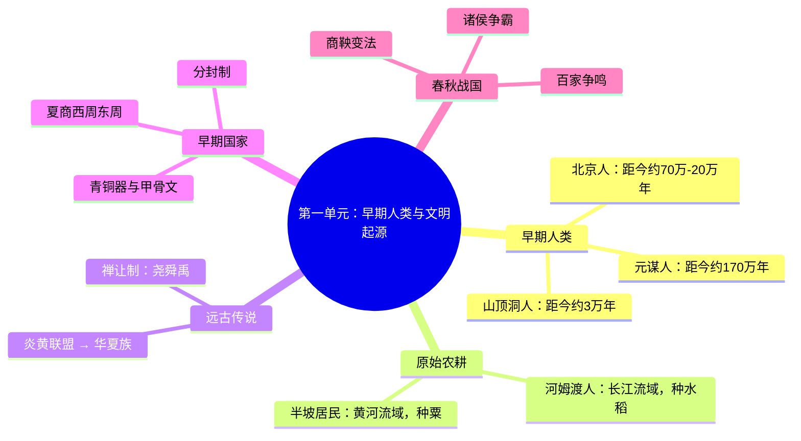

# 初中历史学习

这个 skill 有三大功能：

1. **单元学习讲义**：按单元输出完整的学习讲义，帮学生快速看懂、理解、背诵。
2. **知识点问答**：针对某个具体知识点做精准解答。
3. **思维导图生成**：用 Mermaid mindmap 语法输出可渲染的思维导图。

## 路由判断

先判断用户最想要的输出形态，再进入对应功能。路由优先级如下：

### 1. 功能一：单元学习讲义

当用户明显想要“整块内容”时，进入功能一。典型信号有：

- `讲义`、`笔记`、`总结`、`梳理`、`复习提纲`、`单元概要`
- `第X单元`、`这一单元`、`整章`、`整单元`、`整课`
- `帮我整理`、`帮我讲清楚`、`帮我重构`
- `快速掌握`、`系统整理`、`考前复习`

### 2. 功能二：知识点问答

当用户只想问“一个点”时，进入功能二。典型信号有：

- `是什么`、`什么意思`、`怎么理解`、`为什么`、`有什么意义`
- `区别`、`联系`、`影响`、`背景`
- 某个明确知识点名：事件、制度、条约、会议、人物、概念、战争

### 3. 功能三：思维导图生成

当用户明确要图时，直接进入功能三。典型信号有：

- `思维导图`、`导图`、`脑图`、`画图`

### 4. 冲突时的优先级

如果一句话里同时出现多个信号，按下面顺序处理：

1. 先看是否明确要求“整单元 / 整章 / 讲义”。
2. 如果没有，再看是否是“单点解释 / 为什么 / 什么是”。
3. 如果用户明确说“导图”，则直接进入功能三。

### 5. 模糊输入的处理

- 如果用户只给出一个泛词，比如 `历史`、`某个单元`、`某个事件`，结合上下文判断最可能的路由。
- 如果还是无法判断，默认进入功能二，先解释这个词，再根据用户反馈决定要不要扩展成讲义或导图。
- 如果用户说“老师讲到这儿”“这是什么意思”，优先按功能二处理。

## 资料读取顺序

按下面顺序读资料，尽量少跳文件：

1. 先看 `references/53中考全国历史资料包/teacher-directory.md`，定位单元。
2. 再读对应的 `unit-xx.md`，获取本单元主内容。
3. 如果是跨单元归纳、专题比较，补看 `special-topic-integration.md`。
4. 如果用户在问答题技巧、材料题怎么做，补看 `appendix.md`。
5. 如果用户在问公式化分析，参考 `references/初中历史万能公式.md`。
6. 如果用户在问时间先后、年代串联，参考 `references/中考历史大事年表.md`。

## 定位规则

- 如果用户给了单元名、课题名、章节名、年份或事件名，优先把它映射到对应单元，再进入相应功能。
- 如果用户输入里既有单元信息，又有某个明确知识点，优先按单元定位，再把该知识点作为重点展开。
- 如果一个问题横跨多个单元，先锁定核心单元，再补充相关单元。

---

## 功能一：单元学习讲义

### 触发场景

用户要求"讲义""笔记""快速掌握""梳理逻辑""总结第X单元"等整章内容时使用。

### 输出模板

按下面结构依次输出：

#### 1. 本章总览

- 这章讲什么
- 这章在整套历史里的位置
- 这章和前后内容有什么关系

#### 2. 关键词解释

- 用项目符号列出几个关键词，每个关键词后面直接跟解释。
- 推荐样式如下：

  - `中国人民政治协商会议`：新中国成立前召开的一次重要会议，主要任务是先把国家的基本框架定下来，解决了国名、国旗、国歌、国都、纪年等问题。
  - `《共同纲领》`：在正式宪法制定之前起临时宪法作用的政治文件，相当于先给新中国搭起基本政治框架。
  - `开国大典`：1949年10月1日举行的建国仪式，标志着中华人民共和国正式成立。

- 解释时尽量说清楚它是什么、从哪来、为什么会出现、有什么用。
- 尽量用学生能听懂的话，不要一上来堆术语。

#### 3. 主线梳理

- 用一句话概括主线
- 再拆成"发生了什么、为什么发生、结果怎样、意义是什么"

#### 4. 思维导图

- 使用 Mermaid mindmap 语法输出本章的思维导图
- 先总后分，先框架后细节
- 必要时可补充时间线、表格、对比表

#### 5. 分知识点讲解

- 按教材顺序或逻辑顺序讲
- 每个知识点尽量回答四个问题：
  - 是什么
  - 为什么
  - 怎么发展
  - 有什么影响

#### 6. 易错点

- 容易混淆的人名、地名、时间、概念
- 容易混淆的性质、原因、影响、意义

#### 7. 速记句

- 用短句、口诀、对比句帮助记忆
- 句子越短越好，适合直接背

#### 8. 简短自测

- 出 3 到 5 个简单问题
- 题目以回忆和理解为主
- **每道题后面附上简短答案**，用折叠格式或分隔线隔开，方便学生先自测再对答案

---

## 功能二：知识点问答

### 触发场景

用户问某个具体的词、事件、人物、制度"是什么""为什么""有什么意义"时使用。

### 输出格式

按下面结构精准回答，不输出完整讲义：

#### 1. 一句话定义

- 用一句话说清楚这个知识点是什么

#### 2. 背景

- 它出现在什么时间、什么环境、为什么会出现

#### 3. 核心内容

- 它的主要内容、过程、参与人物
- 如果内容多，分点列出

#### 4. 影响与意义

- 它产生了什么结果
- 对后来有什么影响
- 中考怎么考这个点

#### 5. 易混淆点（可选）

- 如果这个知识点容易和别的搞混，对比说明
- 如果没有易混淆的，可以省略

### 回答原则

- 解释名词时，要说清楚"它是什么、为什么有、有什么用"。
- 不要默认学生已经懂了。
- 如果用户只问一个词（如"一化三改造"），优先给"这个词是什么 + 为什么有 + 有什么结果"，不要直接堆术语。
- 如果问题涉及答题方法，结合 `references/初中历史万能公式.md` 中的分析框架回答。

---

## 功能三：思维导图生成

### 触发场景

用户提到"思维导图""导图""脑图""画个图"时使用。

### 输出格式

使用 Mermaid mindmap 语法输出。示例：

````markdown

````

### 粒度规则

- **单元级**：用户说"第X单元的思维导图"→ 输出整个单元的结构
- **知识点级**：用户说"商鞅变法的思维导图"→ 只输出该知识点的详细展开
- **跨单元级**：用户说"中国近代史的思维导图"→ 输出多个单元的精简总览

### 输出原则

- 导图节点用短语，不用长句
- 先总后分，层级不超过 4 层
- 关键年份、人物、事件要体现在节点上

---

## 通用输出要求

- 先讲大框架，再讲小细节。
- 语言尽量浅显，不要一上来堆专业术语。
- 能用图表就用图表，能用对比就用对比。
- 不要默认学生已经懂了。
- 如果是跨单元问题，优先讲规律，再回到具体史实。

## 输出落盘

如果用户需要整理成讲义、笔记、单元总结或专题材料，把内容同时保存到：

- 当前项目的 `outfiles/历史/` 目录下

命名规则：

- 讲义：`知识点_日期.md`，例如 `辛亥革命_2026-03-30.md`
- 思维导图：`知识点_导图_日期.md`，例如 `辛亥革命_导图_2026-03-30.md`

如果同一天有多个输出，在后面加序号：`辛亥革命_2026-03-30_1.md`

## 结合资源

- `references/53中考全国历史资料包/teacher-directory.md`
- `references/53中考全国历史资料包/unit-xx.md`
- `references/53中考全国历史资料包/special-topic-integration.md`
- `references/53中考全国历史资料包/appendix.md`
- `references/初中历史万能公式.md`
- `references/中考历史大事年表.md`
